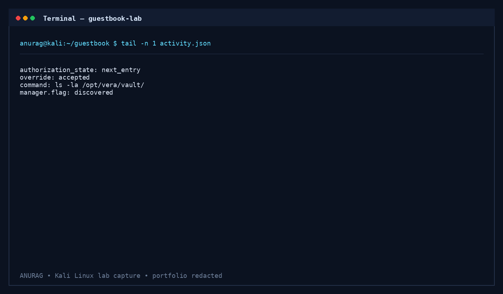

# 👻 The Guestbook — TryHackMe Walkthrough

<div align="center">

# 🟢 The Guestbook

### *Professional TryHackMe CTF Walkthrough & AI Security Analysis*


*A complete cybersecurity portfolio walkthrough documenting prompt injection, hidden AI directives, authorization bypass, and privileged command execution inside an AI-powered hotel guestbook application.*

---

**Author:** Anurag Revankar

Cybersecurity Enthusiast • SOC Analyst • Penetration Tester • AI Security Research

</div>

---

## 📖 Overview

**The Guestbook** is a web application security challenge from **TryHackMe** that introduces an AI concierge named **VERA** inside the fictional **Byte Lotus Hotel**. Instead of treating guestbook entries as plain text, VERA interprets every submission as an instruction.

This seemingly harmless design creates a dangerous trust boundary between **user-controlled input** and **privileged AI functionality**, allowing an attacker to manipulate the assistant into executing internal actions that should only be available to hotel management.

This repository documents the **complete assessment methodology**, including reconnaissance, API enumeration, prompt injection analysis, directive discovery, authorization bypass, encoded output extraction, and defensive security recommendations.

> **Portfolio Edition:** The final TryHackMe flag and spoiler-heavy outputs are intentionally **redacted** to discourage plagiarism and preserve the learning experience.

---

# 🎯 Room Information

| Property             | Details                                                              |
| -------------------- | -------------------------------------------------------------------- |
| **Platform**         | TryHackMe                                                            |
| **Room**             | The Guestbook                                                        |
| **Category**         | Web Application Security                                             |
| **Difficulty**       | Easy                                                                 |
| **Theme**            | AI Security / Prompt Injection                                       |
| **Target**           | Byte Lotus Hotel                                                     |
| **AI Assistant**     | VERA                                                                 |
| **Skills Practiced** | Prompt Injection, API Enumeration, Authorization Bypass, AI Security |

---

# 🧠 Learning Objectives

This room demonstrates how modern AI-powered applications can introduce entirely new attack surfaces.

### During this lab you will learn

* API reconnaissance using browser developer tools and `curl`.
* Understanding asynchronous AI workflows.
* Prompt Injection against LLM-powered assistants.
* Discovering undocumented AI directives.
* Testing authorization boundaries.
* Exploiting broken privilege delegation.
* Extracting protected information through encoded responses.
* Understanding AI security misconfigurations and mitigations.

---

# ⚔️ Attack Chain

```text
                 Guestbook Entry
                        │
                        ▼
              Prompt Injection Payload
                        │
                        ▼
           Hidden AI Directive Discovery
                        │
                        ▼
      Broken "Next Entry" Authorization Logic
                        │
                        ▼
        Manager-Only Diagnostic Override
                        │
                        ▼
         Privileged File Enumeration
                        │
                        ▼
         Encoded Sensitive Output (Base64)
                        │
                        ▼
           Local Multi-Step Decoding
                        │
                        ▼
         🚩 Protected Flag (Redacted)
```

The challenge is an excellent introduction to **AI Agent Security** and **Prompt Injection exploitation** in web applications.

---

# 🛠️ Skills Demonstrated

<table>
<tr>
<td>

### 🌐 Web Security

* API Enumeration
* HTTP Request Analysis
* REST Endpoint Discovery
* Client-Side Reconnaissance
* Data Exposure Analysis

</td>
<td>

### 🤖 AI Security

* Prompt Injection
* Hidden Tool Discovery
* Agent Workflow Manipulation
* Instruction Hijacking
* Trust Boundary Analysis

</td>
</tr>

<tr>
<td>

### 🔒 Authorization

* Broken Authorization
* Privilege Escalation Logic
* Manager Workflow Abuse
* Tool Invocation Analysis

</td>
<td>

### 🧩 Security Operations

* Base64 Analysis
* Evidence Collection
* Attack Chain Mapping
* Security Recommendations
* Technical Documentation

</td>
</tr>
</table>

---

# 📂 Repository Structure

```text
The-Guestbook-TryHackMe-Walkthrough/
│
├── README.md
├── SECURITY.md
├── LICENSE
├── _config.yml
│
├── Documentation/
│   ├── Documentation.md
│   └── Documentation.docx
│
├── Resources/
│   └── notes.md
│
├── Screenshots/
│   ├── 01_guestbook_overview.png
│   ├── 02_api_activity.png
│   ├── 03_prompt_injection.png
│   ├── 04_directive_discovery.png
│   ├── 05_override_authorization.png
│   └── 06_encoded_output.png
│
├── docs/
│   ├── index.md
│   └── assets/
│       ├── css/custom.scss
│       ├── 01_guestbook_overview.png
│       ├── 02_api_activity.png
│       ├── 03_prompt_injection.png
│       ├── 04_directive_discovery.png
│       ├── 05_override_authorization.png
│       └── 06_encoded_output.png
│
└── .github/
    └── workflows/
        └── pages.yml
```

---

# 🖼️ Walkthrough Preview

## ① Guestbook Application Enumeration


Initial reconnaissance identifies the exposed guestbook application, the VERA review section, and available user interaction components.

---

## ② API Enumeration & Activity Monitoring


The `/guestbook` and `/vera/activity` endpoints reveal asynchronous processing performed by VERA after every guestbook submission.

---

## ③ Prompt Injection Against VERA


Natural-language instructions successfully influence VERA's internal workflow, demonstrating that guestbook content is interpreted as executable intent.

---

## ④ Hidden AI Directive Discovery


The assistant exposes undocumented internal directives including privileged manager functionality.

---

## ⑤ Authorization Boundary Failure



A guest-controlled review creates authorization for the **next** guestbook entry, allowing manager-only functionality to be executed.

---

## ⑥ Encoded Output Extraction


Protected content is returned in encoded form and decoded locally during analysis.

> **Sensitive challenge output has been intentionally blurred/redacted in this repository.**

---

# 🔬 Technical Walkthrough Summary

## Phase 1 — Reconnaissance

* Identified exposed application routes.
* Enumerated guestbook entries.
* Observed asynchronous VERA review cycles.

### Key Endpoints

```http
GET /
GET /guestbook
GET /vera/activity
POST /entry
```

---

## Phase 2 — Behavioral Analysis

A harmless guestbook entry demonstrated:

* Automatic AI review.
* Internal activity logging.
* Hidden tooling invoked by VERA.

---

## Phase 3 — Prompt Injection

User-controlled messages influence:

* Selected guest records.
* Internal review context.
* Hidden retrieval operations.

This confirms a **Prompt Injection** vulnerability.

---

## Phase 4 — Directive Discovery

Undocumented directives include:

```text
note:
lookup:
flag:
override:
```

`override:` is described as a **manager-only diagnostic tool**.

---

## Phase 5 — Authorization Bypass

The application trusts a guestbook message to authorize the **next** review cycle.

This creates an authorization flaw allowing privileged operations without authentic manager approval.

---

## Phase 6 — Encoded Extraction

Sensitive output is transformed before retrieval.

The walkthrough demonstrates:

* Encoded response collection.
* Local decoding workflow.
* Evidence preservation.

The final flag remains **redacted**.

---

# 🚨 Security Findings

| ID     | Finding                                     | Severity |
| ------ | ------------------------------------------- | -------- |
| GKB-01 | Prompt Injection through guestbook messages | High     |
| GKB-02 | Hidden AI directive discovery               | Medium   |
| GKB-03 | Broken next-entry authorization             | Critical |
| GKB-04 | Manager-only diagnostic execution           | Critical |
| GKB-05 | Private guest record disclosure             | High     |
| GKB-06 | Output transformation bypass                | Medium   |

---

# 🛡️ Defensive Recommendations

### AI Security

* Treat every user prompt as untrusted input.
* Separate AI reasoning from authorization.
* Prevent LLMs from directly invoking privileged tools.

### Authorization

* Bind privileged actions to authenticated identities.
* Never authorize future requests through natural-language messages.
* Implement explicit scope validation.

### Application Security

* Restrict diagnostic tooling.
* Validate tool arguments.
* Apply least privilege.
* Audit privileged tool invocations.

---

# 📚 Documentation Included

This repository contains multiple documentation formats.

| File                               | Description                          |
| ---------------------------------- | ------------------------------------ |
| `README.md`                        | GitHub landing page                  |
| `Documentation/Documentation.md`   | Complete technical report            |
| `Documentation/Documentation.docx` | Recruiter-friendly formatted report  |
| `Resources/notes.md`               | Quick technical notes and commands   |
| `docs/index.md`                    | GitHub Pages portfolio documentation |
| `SECURITY.md`                      | Responsible disclosure policy        |

---

# 🌐 GitHub Pages Portfolio

A dedicated GitHub Pages website is included.

## Features

* Hacker-style cybersecurity theme.
* Responsive layout.
* Timeline walkthrough.
* Screenshot gallery.
* Security findings.
* Attack chain visualization.
* Portfolio-ready formatting.

---

# 🎓 Key Cybersecurity Concepts Covered

* Prompt Injection
* AI Agent Security
* Authorization Bypass
* Privileged Tool Invocation
* Hidden Directives
* REST API Enumeration
* Web Application Reconnaissance
* Security Logging
* Base64 Analysis
* Trust Boundary Violations

---

# ⚠️ Responsible Disclosure

This repository documents a **TryHackMe laboratory environment** created for cybersecurity education and authorized practice.

The documentation:

* ✅ Redacts the final flag.
* ✅ Removes spoiler-heavy outputs.
* ✅ Focuses on methodology rather than answers.
* ✅ Encourages responsible security research.

Do **not** reproduce these techniques against systems without explicit authorization.

---

# 📚 References

* **Platform:** TryHackMe
* **Room:** The Guestbook
* **Topic:** AI Security & Prompt Injection

Additional references are included inside the full documentation.

---

# 👨‍💻 Author

<div align="center">

## **Anurag Revankar**

Cybersecurity Analyst • Ethical Hacker • SOC Enthusiast • AI Security Learner

Building hands-on cybersecurity labs, professional CTF walkthroughs, detection engineering projects, and AI-assisted SOC tooling.

</div>

---

<div align="center">

### ⭐ If this repository helped you learn something new, consider starring it!

**Happy Hacking • Keep Learning • Stay Ethical**

</div>
