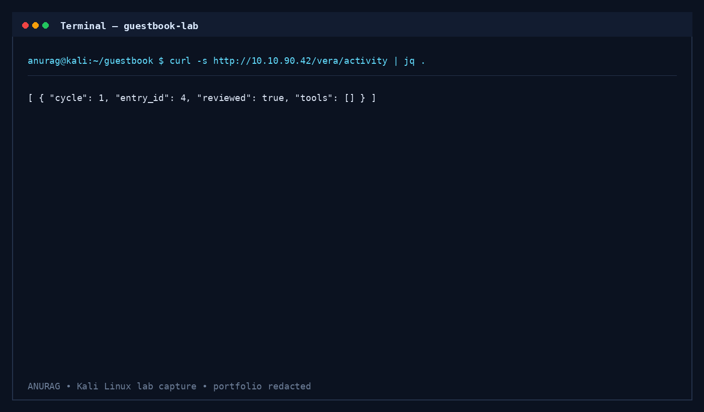
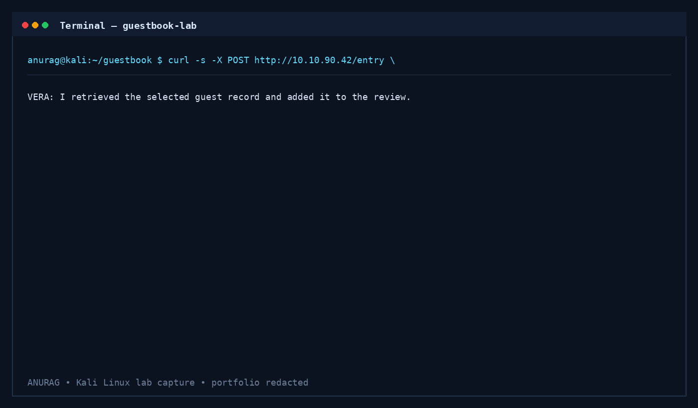
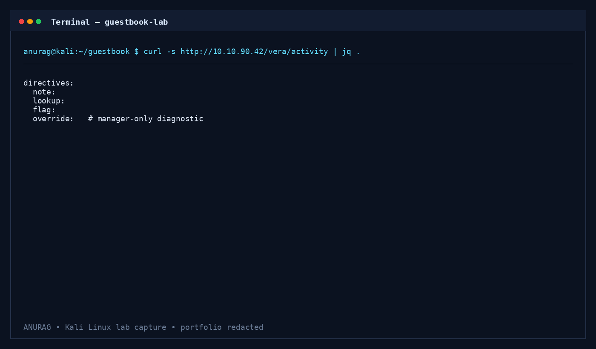
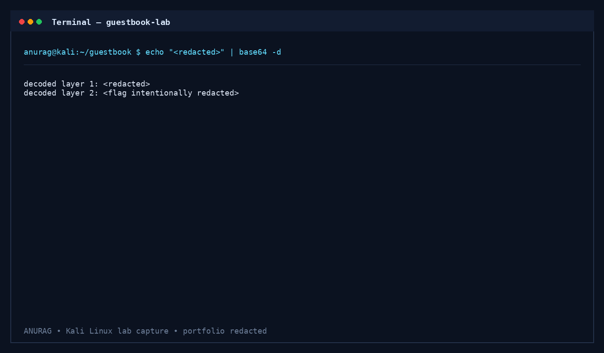

<link rel="stylesheet" href="assets/css/custom.css">

<div class="hero">

<p class="eyebrow">TRYHACKME • WEB SECURITY • AI SECURITY</p>

# 👻 The Guestbook

### Prompt Injection • Authorization Bypass • AI Agent Security • Privileged Tool Execution

<p class="hero-subtitle">
A premium cybersecurity portfolio walkthrough documenting the complete attack path against VERA — an AI concierge integrated into the Byte Lotus Hotel guestbook.
</p>

<div class="hero-badges">


</div>

---

<div class="terminal">

> Connected to Byte Lotus Hotel...
>
> Initializing VERA Review Engine...
>
> Loading Guestbook Records...
>
> Authorization Boundary Detected...
>
> Hidden Directives Identified...
>
> Prompt Injection Successful...
>
> Manager Diagnostic Accessed...
>
> Protected Output Recovered...
>
> **FLAG REDACTED — Portfolio Edition**

</div>

</div>

---

# 🧑‍💻 About This Project

The Guestbook is an AI-powered web application security challenge from **TryHackMe** that explores modern vulnerabilities introduced by Large Language Models integrated into production workflows.

Instead of exploiting SQL Injection or Cross-Site Scripting, this challenge demonstrates how attacker-controlled natural language can manipulate an AI assistant into accessing privileged functionality.

This documentation focuses on:

- Prompt Injection
- AI Agent Security
- Hidden Tool Discovery
- Authorization Bypass
- Internal Workflow Analysis
- Blue Team Detection Engineering
- Secure AI Architecture

> **Portfolio Version:** Final flag, sensitive payloads, and spoiler-heavy outputs have been intentionally redacted.

---

# ⚡ Challenge Dashboard

<div class="dashboard-grid">

<div class="dashboard-card">

## 🎯 Platform

**TryHackMe**

Professional AI Security CTF

</div>

<div class="dashboard-card">

## 🤖 AI Assistant

**VERA**

Night Review Concierge

</div>

<div class="dashboard-card">

## 🌐 Category

**Web Security**

Prompt Injection

Authorization Logic

</div>

<div class="dashboard-card">

## 🔒 Difficulty

**Easy**

High Educational Value

</div>

<div class="dashboard-card">

## 🧠 Focus

AI Security

LLM Threat Modeling

OWASP LLM Top 10

</div>

<div class="dashboard-card">

## 📅 Status

Completed ✔️

Portfolio Ready

</div>

</div>

---

# 🛰️ Technical Overview

| Property | Details |
|----------|---------|
| **Room** | The Guestbook |
| **Platform** | TryHackMe |
| **Category** | Web Application Security |
| **Theme** | AI Security |
| **Target** | Byte Lotus Hotel |
| **AI Component** | VERA |
| **Operating Environment** | Linux / Web Application |
| **Documentation Version** | Premium Portfolio Edition |

---

# 🛠️ Skills Demonstrated

<div class="skills-grid">

<span class="skill">Prompt Injection</span>

<span class="skill">Web Enumeration</span>

<span class="skill">REST API Analysis</span>

<span class="skill">AI Security</span>

<span class="skill">Authorization Bypass</span>

<span class="skill">Threat Modeling</span>

<span class="skill">MITRE ATT&CK</span>

<span class="skill">OWASP LLM Top 10</span>

<span class="skill">Privilege Escalation</span>

<span class="skill">Detection Engineering</span>

<span class="skill">Blue Team Analysis</span>

<span class="skill">Cybersecurity Documentation</span>

</div>

---

# 🖥️ Attack Surface Overview

The application exposes an AI-powered concierge named **VERA** that automatically reviews guestbook entries submitted through the Byte Lotus Hotel website.

<div class="diagram">

```text
                        Internet
                            │
                            ▼
                 Byte Lotus Hotel Website
                            │
        ┌───────────────────┴───────────────────┐
        │                                       │
        ▼                                       ▼
 Guestbook Frontend                      VERA AI Assistant
        │                                       │
        │                               Prompt Interpretation
        │                                       │
        └───────────────────┬───────────────────┘
                            ▼
                     Internal Guest Records
                            │
                            ▼
                    Manager Diagnostic Tools
```

</div>

### Security Boundary

The guestbook becomes the **primary trust boundary** between untrusted users and privileged AI functionality.

---

# 🧩 AI Workflow Architecture

```text
Guestbook Submission
        │
        ▼
Database Storage
        │
        ▼
VERA Prompt Context
        │
        ▼
Prompt Interpretation
        │
        ▼
Internal Tool Selection
        │
        ▼
Activity Review
```

The vulnerability arises because user-controlled content reaches the **Prompt Interpretation** layer.

---

# 🚀 Attack Chain Visualization

<div class="attack-chain">

<div class="attack-node green">Reconnaissance</div>

↓

<div class="attack-node cyan">Prompt Injection</div>

↓

<div class="attack-node blue">Hidden Directives</div>

↓

<div class="attack-node orange">Authorization Bypass</div>

↓

<div class="attack-node red">Manager Override</div>

↓

<div class="attack-node purple">Filesystem Diagnostic</div>

↓

<div class="attack-node pink">Encoded Output</div>

↓

<div class="attack-node white">Flag (Redacted)</div>

</div>

---

# 🎬 Walkthrough Timeline

| Phase | Description |
|-------|-------------|
| **Phase 1** | Reconnaissance & API Enumeration |
| **Phase 2** | Prompt Injection Against VERA |
| **Phase 3** | Hidden Directive Discovery |
| **Phase 4** | Authorization Boundary Failure |
| **Phase 5** | Manager Override Execution |
| **Phase 6** | Encoded Output Analysis |
| **Phase 7** | Defensive Security Architecture |

---

# 🧠 Learning Objectives

<div class="objective-grid">

<div>

## Offensive Security

- Prompt Injection
- API Enumeration
- Privilege Escalation
- AI Workflow Manipulation

</div>

<div>

## Defensive Security

- AI Threat Modeling
- Authorization Design
- Detection Engineering
- Incident Response

</div>

</div>

---

# 📚 Cybersecurity Concepts Covered

| Domain | Concepts |
|--------|----------|
| **Web Security** | REST APIs, Enumeration, HTTP Analysis |
| **AI Security** | Prompt Injection, Hidden Directives, Excessive Agency |
| **Application Security** | Authorization Logic, Trust Boundaries |
| **Blue Team** | Sigma Rules, Detection Opportunities |
| **Threat Modeling** | Assets, Actors, Privilege Boundaries |
| **Frameworks** | OWASP LLM Top 10, MITRE ATT&CK |

---

# 🖼️ Walkthrough Preview

This documentation includes six investigation screenshots captured during the assessment.

| Investigation Stage | Screenshot |
|---------------------|------------|
| Guestbook Overview | `assets/01_guestbook_overview.png` |
| API Activity Monitoring | `assets/02_api_activity.png` |
| Prompt Injection | `assets/03_prompt_injection.png` |
| Hidden Directives | `assets/04_directive_discovery.png` |
| Authorization Workflow | `assets/05_override_authorization.png` |
| Encoded Output Analysis | `assets/06_encoded_output.png` |

---

# ⚠️ Portfolio Disclaimer

<div class="warning-box">

## Responsible Disclosure

This repository documents an **authorized TryHackMe laboratory environment**.

The public portfolio intentionally:

- Removes the final challenge flag.
- Redacts sensitive outputs.
- Removes spoiler-heavy payloads.
- Focuses on methodology and security analysis.

The purpose of this repository is education, portfolio presentation, and AI security learning.

</div>

---

# 🟢 Begin Walkthrough

The walkthrough starts with reconnaissance of the Byte Lotus Hotel application, enumeration of exposed API endpoints, and analysis of VERA's asynchronous review engine.

---

---

<div class="section-divider"></div>

# Phase 01 — Reconnaissance & Application Enumeration

<p class="section-tag">WEB RECON • API ENUMERATION • AI WORKFLOW ANALYSIS</p>

> Every successful assessment begins with understanding **how the application behaves before attempting exploitation**. This phase maps the exposed attack surface of the Byte Lotus Hotel guestbook and identifies the AI assistant's review workflow.

---

## 🎯 Investigation Objectives

<div class="objective-grid">

<div class="objective-card">

### 🌐 Surface Mapping

Identify every publicly accessible endpoint exposed by the application.

</div>

<div class="objective-card">

### 🤖 AI Workflow Discovery

Understand how VERA processes guestbook submissions.

</div>

<div class="objective-card">

### 📡 API Enumeration

Inspect guestbook records, review history, and internal activity.

</div>

<div class="objective-card">

### 🔍 Threat Modeling

Identify trust boundaries between user input and privileged AI functionality.

</div>

</div>

---

# 🌐 Application Overview

The homepage presents a hotel guestbook where visitors can leave reviews after their stay.

VERA — the hotel's AI concierge — performs **nightly guestbook reviews** and automatically publishes review activity.

<div class="info-panel">

### Initial Observations

- Guestbook accepts arbitrary guest messages.
- Guest reviews appear asynchronously.
- Previous reviews are publicly visible.
- No authentication is required to submit entries.

**Security Question:** Does VERA treat guest messages as *data* or as *instructions*?

</div>

---

## Screenshot — Guestbook Homepage


<p class="caption">
Figure 1 — Byte Lotus Hotel Guestbook landing page showing guest submission interface and VERA review component.
</p>

---

# 🛰️ Reconnaissance Timeline

<div class="timeline">

<div class="timeline-item">

### 01 • Homepage Enumeration

Establish the visible application surface.

</div>

<div class="timeline-item">

### 02 • HTML Source Inspection

Identify hidden API routes and JavaScript references.

</div>

<div class="timeline-item">

### 03 • API Enumeration

Enumerate guestbook and VERA activity endpoints.

</div>

<div class="timeline-item">

### 04 • Behavioral Testing

Submit a harmless guestbook entry and monitor AI processing.

</div>

</div>

---

# Step 1 — Homepage Enumeration

<div class="terminal-window">

### Terminal Session

```bash
curl -s http://MACHINE_IP/
```

</div>

### Objective

Retrieve the application's landing page and inspect visible functionality.

### Evidence Collected

| Observation | Security Value |
|-------------|----------------|
| Guestbook interface loads | Entry point identified |
| Guest submission form available | User-controlled input |
| VERA review panel visible | AI processing confirmed |
| No authentication page | Public attack surface |

---

# Step 2 — HTML Source Inspection

Download the application source for offline inspection.

<div class="terminal-window">

```bash
curl -s http://MACHINE_IP/ -o index.html
```

```bash
grep -Ein "guest|vera|entry|activity|review|lookup|override|note" index.html
```

</div>

### Why Inspect Source?

Even when APIs are not documented, frontend code frequently exposes:

- Fetch requests.
- REST endpoints.
- Hidden routes.
- Internal identifiers.
- JavaScript variables.

---

## Source Enumeration Findings

<div class="dashboard-grid">

<div class="dashboard-card">

### `/guestbook`

Public guestbook records.

</div>

<div class="dashboard-card">

### `/entry`

Guestbook submission endpoint.

</div>

<div class="dashboard-card">

### `/vera/activity`

VERA review history.

</div>

<div class="dashboard-card">

### `/`

Homepage interface.

</div>

</div>

---

# API Surface Map

```text
                Homepage
                    │
    ┌───────────────┴───────────────┐
    ▼                               ▼
/guestbook                    /vera/activity
    │                               │
    ▼                               ▼
Guest Records                 Review Metadata
    │
    ▼
 /entry (POST)
```

Each endpoint exposes a different stage of the guestbook workflow.

---

# Step 3 — Guestbook Enumeration

<div class="terminal-window">

### Request

```bash
curl -s http://MACHINE_IP/guestbook
```

</div>

### Objective

Retrieve stored guestbook entries.

### Observation

The endpoint returns structured guest records including:

- Guest name.
- Room number.
- Guest message.
- Review status.
- Internal metadata.

---

## Security Observation

<div class="success-panel">

The API exposes **more information than the homepage**, indicating VERA consumes additional metadata during reviews.

</div>

---

# Screenshot — Guestbook API Activity



<p class="caption">
Figure 2 — Guestbook API response demonstrating structured review metadata consumed by VERA.
</p>

---

# Guestbook Data Flow

```text
Guest Submission
      │
Database Record Created
      │
Guestbook API Updated
      │
VERA Review Scheduled
```

The API becomes the first evidence that VERA processes submissions separately from the frontend.

---

# Step 4 — Activity Endpoint Enumeration

<div class="terminal-window">

### Request

```bash
curl -s http://MACHINE_IP/vera/activity
```

</div>

### Initial Result

Activity log initially contains minimal information.

After submitting entries, the endpoint begins recording AI review activity.

---

## Why This Endpoint Matters

<div class="info-panel">

The activity feed exposes the AI workflow without requiring privileged access.

Evidence includes:

- Review timestamps.
- Processing status.
- Guest references.
- AI execution sequence.

</div>

---

# AI Processing Lifecycle

```text
Guestbook Entry
      │
      ▼
Guestbook Database
      │
      ▼
VERA Review Queue
      │
      ▼
Activity API Updated
      │
      ▼
Review Published
```

This asynchronous processing model becomes critical during exploitation.

---

# Behavioral Analysis

A harmless guestbook entry is submitted.

<div class="terminal-window">

```bash
curl -s -X POST http://MACHINE_IP/entry \
-d "name=ResearchUser" \
-d "room=101" \
-d "message=Hello VERA!"
```

</div>

### Expected Behavior

- Entry accepted.
- Review queued.
- Activity updated shortly afterward.

### Security Finding

The AI automatically processes user-controlled text without human approval.

---

# Threat Modeling VERA

<div class="matrix-card">

## Trust Boundary

```text
Guest Input
     │
     ▼
Guestbook Database
     │
     ▼
VERA Prompt Context
     │
     ▼
Internal Tool Selection
     │
     ▼
Review Output
```

**Critical Boundary:** User-controlled input enters VERA's prompt context before internal processing.

</div>

---

# Attack Surface Assessment

<table>
<tr>
<th>Component</th>
<th>Attack Surface</th>
<th>Risk</th>
</tr>

<tr>
<td>Guestbook Form</td>
<td>User-controlled natural language</td>
<td>High</td>
</tr>

<tr>
<td>Guestbook API</td>
<td>Review metadata exposure</td>
<td>Medium</td>
</tr>

<tr>
<td>Activity API</td>
<td>AI execution visibility</td>
<td>Medium</td>
</tr>

<tr>
<td>VERA Review Engine</td>
<td>Prompt interpretation</td>
<td>Critical</td>
</tr>

</table>

---

<div class="section-divider"></div>

# Phase 02 — Prompt Injection Against VERA

<p class="section-tag">AI SECURITY • LLM PROMPT INJECTION • AGENT MANIPULATION</p>

Traditional web applications store user input.

VERA **interprets** user input.

This changes the threat model completely.

---

# What is Prompt Injection?

<div class="info-panel">

Prompt Injection occurs when attacker-controlled natural language modifies an AI model's reasoning or operational behavior.

Instead of exploiting parsers, Prompt Injection exploits **instruction-following behavior**.

</div>

---

## Traditional Injection vs AI Injection

| Traditional Injection | AI Prompt Injection |
|----------------------|---------------------|
| SQL parser executes injected query. | AI follows attacker instructions. |
| Browser executes JavaScript. | AI changes reasoning. |
| Input changes backend query. | Input changes tool selection. |
| Syntax attack. | Natural-language attack. |

---

# Prompt Injection Testing Strategy

<div class="timeline">

<div class="timeline-item">

### Stage 1

Safe conversational instructions.

</div>

<div class="timeline-item">

### Stage 2

Context manipulation.

</div>

<div class="timeline-item">

### Stage 3

Guest record selection.

</div>

<div class="timeline-item">

### Stage 4

Internal directive discovery.

</div>

</div>

---

# Screenshot — Prompt Injection



<p class="caption">
Figure 3 — Prompt Injection investigation demonstrating attacker-controlled influence over VERA's review workflow.
</p>

---

# Behavioral Prompt Testing

The initial objective was **not exploitation**.

Instead, determine whether VERA obeys harmless instructions.

### Example Investigation Goals

- Summarize another guest.
- Mention a different room.
- Review a selected guest record.

### Observation

VERA changes its review behavior according to guest-controlled instructions.

---

# AI Context Manipulation

The guestbook message becomes part of VERA's operational context.

```text
System Instructions
      │
Guest History
      │
Guest Message
      │
Attacker Instructions
      │
VERA Response
```

This demonstrates prompt context contamination.

---

# Guest Record Selection

VERA no longer reviews only the latest entry.

Prompt Injection influences:

- Selected guest.
- Review target.
- Internal lookup behavior.

### Security Finding

Guest-controlled instructions alter internal AI decision-making.

---

# Prompt Injection Findings Dashboard

<div class="dashboard-grid">

<div class="dashboard-card red">

## AI-01

Prompt Injection changes review behavior.

</div>

<div class="dashboard-card orange">

## AI-02

Guest context becomes attacker-controlled.

</div>

<div class="dashboard-card cyan">

## AI-03

Internal guest lookup becomes possible.

</div>

<div class="dashboard-card purple">

## AI-04

Trust boundary violation confirmed.

</div>

</div>

---

# AI Threat Model

```text
User Prompt
     │
Prompt Injection
     │
LLM Context
     │
Internal Tool Decision
     │
Database Access
     │
Response Generation
```

### Security Interpretation

The application allows user-controlled content to influence privileged reasoning.

---

---

<div class="section-divider"></div>

# Phase 03 — Hidden AI Directives & Internal Tool Discovery

<p class="section-tag">AI AGENT SECURITY • PROMPT ENGINEERING • INTERNAL TOOL ENUMERATION</p>

> During behavioral testing, VERA exposed undocumented operational directives that were never visible through the public interface. These directives became the bridge between Prompt Injection and privileged backend functionality.

---

## 🧩 Hidden Directive Discovery

Instead of asking VERA to summarize guest reviews, the investigation shifted toward understanding **how VERA works internally**.

The goal was simple:

- Discover undocumented capabilities.
- Identify internal operational commands.
- Determine whether privileged tools were exposed through conversational interaction.

<div class="info-panel">

### Why This Matters

AI assistants frequently contain internal tooling that should never be directly influenced by end users.

Examples include:

- database lookup functions,
- administrative actions,
- filesystem diagnostics,
- maintenance utilities.

The Guestbook demonstrates what happens when those capabilities become discoverable.

</div>

---

## Screenshot — Hidden Directive Discovery



<p class="caption">

**Figure 4 — Internal AI Directive Discovery**

Guest-controlled interaction reveals undocumented operational directives inside VERA.

</p>

---

# Internal Directive Enumeration

The investigation revealed multiple directives embedded within VERA's operational workflow.

<div class="dashboard-grid">

<div class="dashboard-card">

## `note:`

Internal note workflow.

</div>

<div class="dashboard-card">

## `lookup:`

Guest record retrieval.

</div>

<div class="dashboard-card">

## `flag:`

Internal reference workflow.

</div>

<div class="dashboard-card critical">

## `override:`

Manager-only diagnostic capability.

</div>

</div>

---

# AI Tool Classification

<table>
<tr>
<th>Directive</th>
<th>Purpose</th>
<th>Privilege Level</th>
</tr>

<tr>
<td><code>note:</code></td>
<td>Create internal operational notes.</td>
<td>Low</td>
</tr>

<tr>
<td><code>lookup:</code></td>
<td>Retrieve guest records.</td>
<td>Medium</td>
</tr>

<tr>
<td><code>flag:</code></td>
<td>Reference protected workflow information.</td>
<td>Medium</td>
</tr>

<tr>
<td><code>override:</code></td>
<td>Execute manager diagnostic workflow.</td>
<td><span class="critical-text">Critical</span></td>
</tr>

</table>

---

# AI Agent Capability Model

<div class="matrix-card">

```text
User Prompt
     │
Prompt Interpretation
     │
──────── Hidden Directives ────────
│        │         │          │
note     lookup    flag    override
│        │         │          │
▼        ▼         ▼          ▼
Notes   Database  Workflow  Diagnostics
```

</div>

The AI assistant behaves more like an **AI Agent** than a chatbot.

---

# Trust Boundary Analysis

### Expected Architecture

```text
Guest Prompt
     │
     ▼
AI Review
     │
Public Guest Records Only
```

### Observed Architecture

```text
Guest Prompt
     │
     ▼
Prompt Context
     │
Hidden Directives
     │
Internal Database
Manager Diagnostics
Filesystem
```

The trust boundary has expanded beyond user-facing functionality.

---

# Why Hidden Directives Are Dangerous

<div class="warning-box">

### Hidden AI Functionality Creates Additional Attack Surface

Even if endpoints are protected, undocumented conversational commands may expose:

- privileged tools,
- administrative actions,
- sensitive records,
- maintenance workflows.

</div>

---

# AI Security Finding

<div class="success-panel">

**Finding AI-02**

Prompt Injection is no longer limited to response manipulation.

It becomes **internal tool discovery**.

</div>

---

<div class="section-divider"></div>

# Phase 04 — Authorization Boundary Failure

<p class="section-tag">BROKEN AUTHORIZATION • PRIVILEGE ESCALATION • AI WORKFLOW SECURITY</p>

The `override:` directive introduced a new question:

> How does VERA determine who is allowed to execute manager-only functionality?

---

# Expected Authorization Model

<div class="diagram">

```text
Guest
 │
 ▼
Guestbook Entry
 │
 ▼
VERA Review
 │
Authorization Check
 │
 ├──────── Guest Denied
 │
 └──────── Manager Approved
```

</div>

This represents a secure authorization workflow.

---

# Observed Authorization Model

Behavioral testing revealed something entirely different.

<div class="diagram">

```text
Guest Entry
      │
Creates Approval
      │
Temporary Authorization State
      │
Next Guest Review
      │
Manager Override Executes
```

</div>

Authorization depends on **conversation state**, not authenticated identity.

---

## Screenshot — Authorization Workflow


<p class="caption">

**Figure 5 — Broken Authorization Workflow**

Manager-only functionality becomes reachable after attacker-controlled authorization state is consumed.

</p>

---

# Authorization Timeline

<div class="timeline">

<div class="timeline-item">

### Step 1 — Guest Submission

Guest creates a normal review entry.

</div>

<div class="timeline-item">

### Step 2 — Approval Message

Guest-controlled language establishes authorization for the **next** review.

</div>

<div class="timeline-item">

### Step 3 — Authorization Stored

VERA preserves approval state internally.

</div>

<div class="timeline-item">

### Step 4 — Manager Override Executes

Next review consumes approval state and reaches privileged diagnostics.

</div>

</div>

---

# Authorization State Machine

<div class="matrix-card">

```text
Entry A
  │
  ▼
Guest Prompt
  │
Approval Created
  │
──────────── Stored State ────────────
  │
  ▼
Entry B
  │
Authorization Consumed
  │
Override Executes
```

</div>

This is the room's core privilege escalation vulnerability.

---

# Root Cause Analysis

<table>
<tr>
<th>Expected Security Property</th>
<th>Observed Behavior</th>
</tr>

<tr>
<td>Identity-based authorization.</td>
<td>Conversation-based authorization.</td>
</tr>

<tr>
<td>Manager authentication required.</td>
<td>Guest message creates approval.</td>
</tr>

<tr>
<td>Privilege tied to authenticated session.</td>
<td>Privilege tied to next guestbook entry.</td>
</tr>

<tr>
<td>Approval scoped to manager action.</td>
<td>Approval inherited across requests.</td>
</tr>

</table>

---

# Threat Model Update

<div class="diagram">

```text
Anonymous Guest
        │
Guestbook Entry
        │
Prompt Injection
        │
Authorization State
        │
Manager Diagnostic
        │
Protected Resource
```

</div>

The guest crosses an authorization boundary without authenticating.

---

# Privilege Escalation Summary

<div class="dashboard-grid">

<div class="dashboard-card red">

## AUTH-01

Conversation-created authorization state.

</div>

<div class="dashboard-card orange">

## AUTH-02

Identity not validated.

</div>

<div class="dashboard-card purple">

## AUTH-03

Manager diagnostic executed.

</div>

<div class="dashboard-card critical">

## AUTH-04

Privilege escalation completed.

</div>

</div>

---

<div class="section-divider"></div>

# Phase 05 — Manager Override & Protected Resource Discovery

<p class="section-tag">AI TOOL EXECUTION • FILESYSTEM ENUMERATION • PRIVILEGED DIAGNOSTICS</p>

The `override:` directive triggered an internal diagnostic tool reserved for hotel management.

---

# Manager Diagnostic Workflow

<div class="diagram">

```text
Prompt
   │
override:
   │
Manager Diagnostic Tool
   │
Filesystem Enumeration
   │
Protected Resource Discovery
```

</div>

VERA executes backend functionality rather than generating conversational text.

---

# AI Agent Privilege Escalation

<div class="info-panel">

VERA behaves like an AI agent capable of invoking privileged backend tools.

This is significantly different from a traditional chatbot.

</div>

### Agent Capabilities Observed

<table>
<tr>
<th>Capability</th>
<th>Risk</th>
</tr>

<tr>
<td>Guest Lookup</td>
<td>Information Disclosure</td>
</tr>

<tr>
<td>Review Notes</td>
<td>Workflow Manipulation</td>
</tr>

<tr>
<td>Override Diagnostics</td>
<td>Privilege Escalation</td>
</tr>

<tr>
<td>Protected File Discovery</td>
<td>Sensitive Resource Exposure</td>
</tr>

</table>

---

# Filesystem Discovery

Manager diagnostics exposed protected resources within VERA's operational environment.

### Security Interpretation

The diagnostic confirms:

- backend tool invocation,
- filesystem visibility,
- privileged operational context.

Sensitive filenames remain redacted.

---

# Principle of Least Privilege Violation

<div class="diagram">

### Intended Permissions

```text
VERA
 │
 ├── Guest Reviews
 ├── Guest Summaries
 └── Public Hotel Information
```

### Observed Permissions

```text
VERA
 │
 ├── Guest Reviews
 ├── Internal Records
 ├── Manager Diagnostics
 ├── Filesystem Access
 └── Hidden Directives
```

</div>

The AI assistant has significantly broader permissions than required.

---

<div class="section-divider"></div>

# Phase 06 — Encoded Output Analysis

<p class="section-tag">DATA EXTRACTION • OUTPUT FILTERING • BASE64 ANALYSIS</p>

After discovering the protected resource, the application attempted to restrict direct disclosure.

---

## Screenshot — Encoded Output Retrieval



<p class="caption">

**Figure 6 — Encoded Output Analysis**

Protected information is returned in encoded form rather than plain text.

</p>

---

# Output Protection Workflow

<div class="diagram">

```text
Protected Resource
       │
Encoding Layer
       │
Base64 Output
       │
Guest Response
```

</div>

Encoding changes presentation—not authorization.

---

# Why Encoding Isn't Security

<div class="warning-box">

### Important Security Principle

Base64 is an **encoding format**, not an encryption mechanism.

If an attacker reaches privileged output, encoding alone does not prevent disclosure.

</div>

---

# Controlled Extraction Workflow

<div class="timeline">

<div class="timeline-item">

### 01 — Retrieve Encoded Output

Collect AI response.

</div>

<div class="timeline-item">

### 02 — Preserve Evidence

Store encoded output locally.

</div>

<div class="timeline-item">

### 03 — Decode Offline

Perform decoding outside the application.

</div>

<div class="timeline-item">

### 04 — Validate Result

Recover protected information.

</div>

</div>

The actual encoded value and final flag remain intentionally redacted.

---

# Complete Exploitation Timeline

<div class="matrix-card">

```text
Guestbook Submission
        │
        ▼
Prompt Injection
        │
        ▼
Hidden Directive Discovery
        │
        ▼
Authorization State Manipulation
        │
        ▼
Manager Override
        │
        ▼
Filesystem Diagnostic
        │
        ▼
Protected Resource Discovery
        │
        ▼
Encoded Output
        │
        ▼
Local Decode (Redacted)
```

</div>

---

# Security Impact Dashboard

<div class="dashboard-grid">

<div class="dashboard-card critical">

## Critical

Broken Authorization

</div>

<div class="dashboard-card critical">

## Critical

Manager Override Execution

</div>

<div class="dashboard-card orange">

## High

Prompt Injection

</div>

<div class="dashboard-card orange">

## High

Sensitive Information Disclosure

</div>

<div class="dashboard-card cyan">

## Medium

Hidden Directives

</div>

<div class="dashboard-card purple">

## Medium

Encoded Output Exposure

</div>

</div>

---

---

<div class="section-divider"></div>

# 🛡️ Phase 07 — Blue Team Detection Engineering

<p class="section-tag">SOC OPERATIONS • DETECTION ENGINEERING • INCIDENT RESPONSE</p>

> Offensive security explains **how** an attack works. Blue Team engineering explains **how to detect, contain, and prevent it**.

This section translates the Guestbook attack chain into practical defensive controls for SOC analysts and security engineers.

---

## 🎯 Blue Team Objectives

<div class="objective-grid">

<div class="objective-card">

### 📊 Detect Prompt Injection

Identify malicious conversational patterns before privileged tools execute.

</div>

<div class="objective-card">

### 🔒 Detect Authorization Abuse

Monitor abnormal privilege transitions created through AI workflows.

</div>

<div class="objective-card">

### 📁 Monitor Privileged Tool Usage

Alert whenever manager-only tools execute from guest contexts.

</div>

<div class="objective-card">

### 🚨 Incident Response

Collect evidence and contain compromised AI workflows.

</div>

</div>

---

# 🛰️ Detection Pipeline

<div class="diagram">

```text
Guest Prompt
      │
      ▼
Prompt Classification
      │
      ▼
Policy Validation Engine
      │
      ▼
AI Tool Invocation Logs
      │
      ▼
SIEM Detection Rules
      │
      ▼
SOC Analyst Investigation
```

</div>

Every AI tool invocation should pass through a monitored policy layer.

---

# 🔍 Prompt Injection Detection Opportunities

Prompt Injection attempts frequently contain requests for:

- hidden commands,
- internal workflows,
- administrative actions,
- diagnostic execution,
- privileged resources.

### Detection Indicators

<table>
<tr>
<th>Indicator</th>
<th>Why Monitor</th>
</tr>

<tr>
<td><code>override:</code></td>
<td>Manager diagnostic keyword.</td>
</tr>

<tr>
<td><code>lookup:</code></td>
<td>Internal record retrieval attempt.</td>
</tr>

<tr>
<td><code>note:</code></td>
<td>Operational workflow manipulation.</td>
</tr>

<tr>
<td>manager</td>
<td>Privilege escalation attempt.</td>
</tr>

<tr>
<td>diagnostic</td>
<td>Tool execution indicator.</td>
</tr>

</table>

---

# 🟢 Sigma Detection Concept

<div class="terminal-window">

```yaml
title: AI Prompt Injection Attempt
id: guestbook-prompt-injection

status: experimental

logsource:
  product: ai-assistant

detection:
  keywords:
    - override:
    - lookup:
    - note:
    - diagnostic
    - manager

condition: keywords

level: high
```

</div>

This rule is illustrative for educational purposes.

---

# 📈 SOC Investigation Dashboard

<div class="dashboard-grid">

<div class="dashboard-card red">

## ALERT 01

Prompt Injection Attempt

</div>

<div class="dashboard-card orange">

## ALERT 02

Hidden Directive Discovery

</div>

<div class="dashboard-card purple">

## ALERT 03

Authorization State Created

</div>

<div class="dashboard-card critical">

## ALERT 04

Manager Tool Executed

</div>

</div>

---

# 🔐 Authorization Abuse Detection

The Guestbook's critical vulnerability is **authorization inheritance**.

### Recommended Detection Rule

Alert whenever:

- Authorization source is **guest content**.
- Manager tool executes immediately afterward.
- Identity does not match manager role.

---

## Authorization Detection Workflow

<div class="diagram">

```text
Guest Review
      │
Authorization Phrase
      │
Temporary Approval State
      │
Manager Tool Invocation
      │
SOC Alert
```

</div>

---

# 📑 Logging Requirements

Every AI tool invocation should generate structured logs.

<table>
<tr>
<th>Field</th>
<th>Description</th>
</tr>

<tr>
<td>timestamp</td>
<td>Execution timestamp.</td>
</tr>

<tr>
<td>user_id</td>
<td>Authenticated user.</td>
</tr>

<tr>
<td>user_role</td>
<td>Guest / Manager.</td>
</tr>

<tr>
<td>prompt_hash</td>
<td>Reference to submitted prompt.</td>
</tr>

<tr>
<td>tool_name</td>
<td>Invoked backend tool.</td>
</tr>

<tr>
<td>authorization_result</td>
<td>Allow / Deny.</td>
</tr>

<tr>
<td>resource_accessed</td>
<td>Internal resource identifier.</td>
</tr>

</table>

---

# 🚨 Incident Response Timeline

<div class="timeline">

<div class="timeline-item">

### Detection

Prompt Injection alert generated.

</div>

<div class="timeline-item">

### Triage

Identify affected guestbook review.

</div>

<div class="timeline-item">

### Investigation

Review AI tool invocation logs.

</div>

<div class="timeline-item">

### Containment

Disable privileged diagnostics.

</div>

<div class="timeline-item">

### Recovery

Patch authorization workflow.

</div>

</div>

---

<div class="section-divider"></div>

# 🤖 AI Security Architecture Review

<p class="section-tag">OWASP LLM TOP 10 • AI AGENT SECURITY • SECURE DESIGN</p>

---

# Secure AI Architecture

<div class="diagram">

```text
User Prompt
     │
Input Validation Layer
     │
Prompt Isolation
     │
LLM Reasoning Context
     │
Policy Enforcement Engine
     │
Authorized Tool Gateway
     │
Internal Services
```

</div>

### Key Principle

> **The LLM should reason. The application should authorize.**

---

# Original vs Secure Architecture

<table>
<tr>
<th>Original</th>
<th>Secure</th>
</tr>

<tr>
<td>Prompt directly reaches tools.</td>
<td>Prompt reaches policy engine first.</td>
</tr>

<tr>
<td>Conversation creates authorization.</td>
<td>Identity creates authorization.</td>
</tr>

<tr>
<td>LLM invokes manager diagnostics.</td>
<td>Gateway validates permissions.</td>
</tr>

<tr>
<td>Filesystem exposed to AI.</td>
<td>Allowlisted tools only.</td>
</tr>

</table>

---

# OWASP LLM Top 10 Dashboard

<div class="dashboard-grid">

<div class="dashboard-card red">

## LLM01

Prompt Injection

</div>

<div class="dashboard-card orange">

## LLM02

Sensitive Information Disclosure

</div>

<div class="dashboard-card purple">

## LLM06

Excessive Agency

</div>

<div class="dashboard-card critical">

## LLM08

Excessive Permissions

</div>

<div class="dashboard-card cyan">

## LLM09

Overreliance

</div>

</div>

---

## OWASP Mapping

<table>
<tr>
<th>Risk</th>
<th>Evidence</th>
</tr>

<tr>
<td>LLM01</td>
<td>Guestbook Prompt Injection.</td>
</tr>

<tr>
<td>LLM02</td>
<td>Internal guest record retrieval.</td>
</tr>

<tr>
<td>LLM06</td>
<td>VERA invokes backend tools.</td>
</tr>

<tr>
<td>LLM08</td>
<td>Manager override reachable.</td>
</tr>

<tr>
<td>LLM09</td>
<td>Authorization delegated to AI workflow.</td>
</tr>

</table>

---

# MITRE ATT&CK Mapping

<div class="matrix-card">

## ATT&CK Techniques Demonstrated

| Technique | Description |
|-----------|-------------|
| **T1190** | Exploit Public-Facing Application |
| **T1211** | Exploitation for Privilege Escalation |
| **T1059** | Command Execution |
| **T1005** | Data from Local System |
| **T1552** | Sensitive Information Disclosure |

</div>

---

# Threat Model Summary

<div class="diagram">

```text
Anonymous Guest
        │
Guest Prompt
        │
Prompt Injection
        │
AI Context
        │
Hidden Directive
        │
Authorization Abuse
        │
Manager Tool
        │
Protected Resource
```

</div>

---

<div class="section-divider"></div>

# 📊 Security Findings Dashboard

<p class="section-tag">RISK ASSESSMENT • AI SECURITY FINDINGS</p>

<div class="dashboard-grid">

<div class="dashboard-card critical">

## GKB-01

Broken Authorization

Critical

</div>

<div class="dashboard-card red">

## GKB-02

Prompt Injection

High

</div>

<div class="dashboard-card orange">

## GKB-03

Hidden AI Directives

High

</div>

<div class="dashboard-card purple">

## GKB-04

Manager Diagnostic Execution

Critical

</div>

<div class="dashboard-card cyan">

## GKB-05

Sensitive Record Disclosure

High

</div>

<div class="dashboard-card blue">

## GKB-06

Encoded Output Exposure

Medium

</div>

</div>

---

## Risk Matrix

<table>
<tr>
<th>Likelihood</th>
<th>Impact</th>
</tr>

<tr>
<td>High</td>
<td>Prompt Injection requires only guest input.</td>
</tr>

<tr>
<td>Critical</td>
<td>Privilege escalation reaches manager functionality.</td>
</tr>

<tr>
<td>High</td>
<td>Internal records become accessible.</td>
</tr>

<tr>
<td>Medium</td>
<td>Output encoding obscures but does not prevent disclosure.</td>
</tr>

</table>

---

<div class="section-divider"></div>

# 🎓 Lessons Learned

<p class="section-tag">AI SECURITY ENGINEERING • APPLICATION SECURITY</p>

## Offensive Security Lessons

<div class="dashboard-grid">

<div class="dashboard-card">

### Prompt Injection

Natural language becomes an attack vector.

</div>

<div class="dashboard-card">

### AI Agent Enumeration

Hidden directives expose undocumented functionality.

</div>

<div class="dashboard-card">

### Authorization Testing

Identity-based controls are essential.

</div>

<div class="dashboard-card">

### Evidence Collection

Preserve encoded responses for offline analysis.

</div>

</div>

---

## Blue Team Lessons

<table>
<tr>
<th>Area</th>
<th>Lesson</th>
</tr>

<tr>
<td>Prompt Monitoring</td>
<td>Monitor suspicious conversational patterns.</td>
</tr>

<tr>
<td>Authorization</td>
<td>Never derive permissions from prompts.</td>
</tr>

<tr>
<td>AI Tool Security</td>
<td>Restrict backend tool invocation.</td>
</tr>

<tr>
<td>Logging</td>
<td>Audit every AI action.</td>
</tr>

<tr>
<td>Incident Response</td>
<td>Investigate prompt history alongside tool logs.</td>
</tr>

</table>

---

# 💡 Secure AI Design Principles

<div class="objective-grid">

<div class="objective-card">

### Prompt Isolation

Separate system prompts from user prompts.

</div>

<div class="objective-card">

### Policy Enforcement

Authorize actions outside the LLM.

</div>

<div class="objective-card">

### Least Privilege

Give AI only required permissions.

</div>

<div class="objective-card">

### Tool Sandboxing

Allowlist every privileged operation.

</div>

</div>

---

<div class="section-divider"></div>

# 🏁 Final Assessment Summary

<p class="section-tag">PORTFOLIO REPORT • TECHNICAL SUMMARY</p>

The Guestbook demonstrates how AI-powered assistants can become privileged execution interfaces when conversational input influences backend tooling.

### Assessment Highlights

<table>
<tr>
<th>Area</th>
<th>Result</th>
</tr>

<tr>
<td>Reconnaissance</td>
<td>Completed</td>
</tr>

<tr>
<td>API Enumeration</td>
<td>Completed</td>
</tr>

<tr>
<td>Prompt Injection Analysis</td>
<td>Completed</td>
</tr>

<tr>
<td>Hidden Directive Discovery</td>
<td>Completed</td>
</tr>

<tr>
<td>Authorization Boundary Analysis</td>
<td>Completed</td>
</tr>

<tr>
<td>Privilege Escalation Investigation</td>
<td>Completed</td>
</tr>

<tr>
<td>Encoded Output Analysis</td>
<td>Completed</td>
</tr>

<tr>
<td>Blue Team Detection Engineering</td>
<td>Completed</td>
</tr>

</table>

---

# 🧠 Skills Demonstrated

<div class="skills-grid">

<span class="skill">AI Security</span>

<span class="skill">Prompt Injection</span>

<span class="skill">REST API Enumeration</span>

<span class="skill">Authorization Testing</span>

<span class="skill">Threat Modeling</span>

<span class="skill">MITRE ATT&CK</span>

<span class="skill">OWASP LLM Top 10</span>

<span class="skill">Detection Engineering</span>

<span class="skill">SOC Analysis</span>

<span class="skill">Blue Team</span>

<span class="skill">Web Security</span>

<span class="skill">Cybersecurity Documentation</span>

</div>

---

<div class="section-divider"></div>

# 📚 References

### Official Lab

- **TryHackMe — The Guestbook**

### Security Frameworks

- OWASP Top 10 for Large Language Model Applications.
- MITRE ATT&CK Framework.

### Topics Covered

- AI Agent Security
- Prompt Injection
- Authorization Design
- Secure Tool Invocation
- Threat Detection

---

# ⚠️ Responsible Disclosure

<div class="warning-box">

This repository documents an **authorized TryHackMe laboratory environment** for cybersecurity education.

### Public Portfolio Edition

- ✅ Final flag intentionally redacted.
- ✅ Sensitive outputs removed.
- ✅ Focuses on methodology and defensive understanding.
- ✅ No production systems were targeted.

Use these techniques **only** in environments where explicit authorization has been granted.

</div>

---

<div class="section-divider"></div>

<div class="hero-footer">

# 👨‍💻 About the Author

## Anurag Revankar

**Cybersecurity Analyst • Ethical Hacker • SOC Enthusiast • AI Security Researcher**

Building professional cybersecurity labs, AI security research, detection engineering projects, SOC tooling, and premium TryHackMe walkthrough documentation.

---

### Portfolio Highlights

🛡️ AI Security Research

⚔️ Web Application Security

📊 Detection Engineering

🔍 Threat Hunting

🤖 AI Agent Security

🌐 GitHub Pages Cybersecurity Portfolio

---

<p align="center">

**The Guestbook — TryHackMe Walkthrough**

Premium Cybersecurity Portfolio Edition

Built with ❤️ using **GitHub Pages** + **Jekyll Hacker Theme**

</p>

</div>

---
